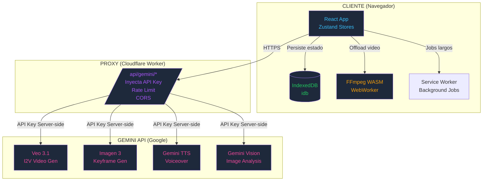

# 00_ARQUITECTURA.md — Bridge Creative Engine (Standalone, Gemini-only)

**Versión:** 1.0  
**Fecha:** 2026-07-03  
**ADR Principal:** `ARCH-20260703-01`

---

## 🏗️ STACK TECNOLÓGICO DEFINITIVO

| Capa | Tecnología | Versión | Justificación |
|------|------------|---------|---------------|
| **Build/Dev** | Vite + TypeScript | 5.x / 5.5 | HMR rápido, ESM nativo, typecheck estricto |
| **UI Framework** | React | 18.3 | Componentes reutilizables, ecosystem maduro |
| **Styling** | Tailwind CSS | 3.4 | Utility-first, dark mode nativo, bundle pequeño |
| **Estado Global** | Zustand + Immer | 4.5 / 10.1 | Simple, reactivo, middleware persist |
| **Persistencia Local** | IndexedDB (idb) | 8.0 | Offline-first, blobs grandes, transaccional |
| **Video/FFmpeg** | @ffmpeg/ffmpeg + @ffmpeg/util | 0.12.x | WASM, WebWorker, concat + burn subs + mix audio client-side |
| **IA Generativa** | Gemini API (Veo 3.1, Imagen 3, TTS) | v1beta | Proveedor único, multimodal nativo, streaming |
| **Proxy API Keys** | Cloudflare Workers | — | Keys solo server-side, CORS resuelto, rate limit |
| **Testing** | Vitest + Playwright | 2.x / 1.4 | Unit + E2E visual regression |
| **CI/CD** | GitHub Actions + Vercel/Netlify | — | Typecheck → Lint → Test → Build → Deploy Preview |
| **Docs** | Markdown + Mermaid + Storybook | — | Living docs, component catalog |

---

## 🎯 DECISIONES ARQUITECTÓNICAS CLAVE (ADRs)

| ADR | Título | Estado | Archivo |
|-----|--------|--------|---------|
| `ARCH-20260703-01` | Gemini-only, Standalone, Keyframe Chain | ✅ Aceptado | `decisions/ARCH-20260703-01.md` |
| `ARCH-20260703-02` | Proxy Backend para API Keys (Cloudflare Worker) | ✅ Aceptado | `decisions/ARCH-20260703-02.md` |
| `ARCH-20260703-03` | FFmpeg WASM Client-Side (No Backend Video) | ✅ Aceptado | `decisions/ARCH-20260703-03.md` |
| `ARCH-20260703-04` | Keyframe Chain Anti-Hallucination (I2V Anclado) | ✅ Aceptado | `decisions/ARCH-20260703-04.md` |

---

## 📐 DIAGRAMA DE ARQUITECTURA GENERAL



---

## 🔄 PIPELINE DE PRODUCCIÓN (Data Flow)

```
┌─────────────────────────────────────────────────────────────────────────────┐
│                        PIPELINE COMPLETO (Happy Path)                       │
├─────────────────────────────────────────────────────────────────────────────┤
│                                                                             │
│  1. BRIEF WIZARD (Usuario)                                                 │
│     ├─ Negocio: nombre, descripción, sector, audiencia, diferenciadores   │
│     ├─ Servicios: [{nombre, descripción, precio, beneficio clave}]        │
│     ├─ Visión Global: estilo, música, pacing, tone keywords               │
│     └─ 4 Etapas AIDA por servicio: descripción natural por nodo           │
│                                    │                                       │
│                                    ▼                                       │
│  2. LLM → EXECUTABLE PROJECT (Gemini 2.5 Pro)                             │
│     ├─ BrandKit: nombre, acrónimo, slogan, palette, fonts, tone           │
│     ├─ ServicePacks: por servicio → 4 nodos AIDA con:                     │
│     │   • title, voiceover (listo TTS), movementPrompt (listo Veo)        │
│     │   • imageHints: ["descripción foto 1", "descripción foto 2"]        │
│     └─ GlobalStylePrompt: inyectado en CADA llamada Veo/Imagen            │
│                                    │                                       │
│                                    ▼                                       │
│  3. KEYFRAME STORYBOARD (Usuario + IA)                                    │
│     ├─ KF0: Logo (subida) → Imagen 3 → Bumper animado                     │
│     ├─ KF1: Problema (subida) → Vision Analysis                            │
│     ├─ KF1_OUT: Generado Imagen 3 desde KF1 + intención "abrir a motor"  │
│     ├─ KF2: Taller/Espacio (subida) → Vision Analysis                     │
│     ├─ KF2_OUT: Generado Imagen 3 desde KF2 + intención                   │
│     ├─ KF3: Solución (subida) → Vision Analysis                           │
│     ├─ KF3_OUT: Generado Imagen 3 desde KF3 + intención                   │
│     ├─ KF4: CTA Base (render canvas: foto + overlay marca)                │
│     └─ KF5: CTA Final (subida foto recepción)                             │
│                                    │                                       │
│                                    ▼                                       │
│  4. PROMPT APPROVAL GATES (Usuario aprueba CADA prompt)                   │
│     ├─ 5 Transiciones Keyframe→Keyframe (Veo I2V)                         │
│     ├─ 3-4 Keyframes OUT generadas (Imagen 3)                             │
│     ├─ 1 Bumper (Imagen 3 + Veo I2I)                                      │
│     ├─ 1 CTA I2V (Veo desde KF4)                                          │
│     └─ 1 TTS (Gemini TTS: concat 4 voiceovers)                            │
│                                    │                                       │
│                                    ▼                                       │
│  5. GENERACIÓN PARALELA (Background Job Queue)                            │
│     ├─ Veo I2V: 5 transiciones + 1 CTA + 1 Bumper = 7 clips              │
│     ├─ Imagen 3: 3-4 keyframes OUT                                        │
│     └─ TTS: 1 audio master ~30s                                           │
│                                    │                                       │
│                                    ▼                                       │
│  6. FFMPEG WASM (WebWorker)                                               │
│     ├─ Concat: bumper + trans_1 + trans_2 + trans_3 + trans_4 + CTA      │
│     ├─ Burn Subs: WebVTT → estilo marca (font, color, outline, safezone) │
│     ├─ Mix Audio: VO master + music bed (opcional) → AAC 128k            │
│     ├─ Encode: H.264, 1080x1920 (9:16), 30fps, -t 30                     │
│     └─ Output: master.mp4 + subs.vtt + vo.wav + manifest.json            │
│                                    │                                       │
│                                    ▼                                       │
│  7. EXPORT CENTER                                                         │
│     ├─ Master 9:16 (Reels/TikTok/Shorts)                                  │
│     ├─ Pack RRSS: 1:1, 4:5, 16:9 (crop inteligente + safe zones)         │
│     ├─ Assets individuales: 7 clips + audio + subs + manifest            │
│     └─ Share Link: blob URL + QR + expiración                            │
│                                                                             │
└─────────────────────────────────────────────────────────────────────────────┘
```

---

## 🗃️ ESQUEMA DE DATOS PRINCIPAL (TypeScript Types)

```typescript
// types/brief.ts
interface MasterBrief {
  id: string;
  business: BusinessIdentity;
  services: ServiceToAdvertise[];
  globalVision: GlobalAdVision;
  serviceStages: Record<string, AidaStageDescription>; // key = serviceId
  createdAt: number;
  updatedAt: number;
}

// types/keyframe.ts
interface Keyframe {
  id: string;                    // kf_0, kf_atencion_in, kf_deseo_out_auto...
  role: KeyframeRole;            // 'bumper_start' | 'atencion_in' | 'atencion_out' | ...
  label: string;                 // "Logo", "Problema", "Taller OUT (Auto)"
  source: 'user_upload' | 'generated_imagen3' | 'cta_render' | 'previous_output';
  blob?: Blob;
  base64?: string;
  mimeType?: string;
  visualAnalysis?: VisualAnalysis;      // Gemini Vision output
  humanIntent?: string;                 // Usuario: "abrir a motor sucio"
  humanDescription?: string;            // Usuario: "motor sucio desenfocado"
  generationPrompt?: string;            // Prompt usado en Imagen 3
  cameraSpec?: CameraSpec;              // Para transiciones OUT→IN siguiente
  timestamp: number;                    // Segundos en timeline final
  status: 'empty' | 'uploaded' | 'analyzed' | 'generating' | 'generated' | 'approved' | 'failed';
}

// types/transition.ts
interface KeyframeTransition {
  id: string;                    // trans_atencion, trans_interes...
  fromKeyframe: string;          // kf_atencion_in
  toKeyframe: string;            // kf_atencion_out
  nodeKey: 'bumper' | 'atencion' | 'interes' | 'deseo' | 'accion' | 'cta';
  duration: number;              // Segundos (3, 4, 6, 7, 4, 3)
  prompt: string;                // Prompt APROBADO por usuario
  cameraSpec: CameraSpec;
  status: 'pending' | 'prompt_ready' | 'approved' | 'generating' | 'done' | 'failed';
  videoBlob?: Blob;
  videoUrl?: string;
  veoOperationId?: string;
  generatedAt?: number;
  promptHistory: PromptVersion[];   // Trazabilidad: original, aprobado, diffs
}

// types/project.ts
interface ProjectState {
  // Brief & Config
  brief: MasterBrief | null;
  executableProject: ExecutableProject | null;  // Output LLM step 2
  brandKit: BrandKit | null;
  servicePacks: ServicePack[];
  globalStylePrompt: string;
  
  // Keyframes & Transitions
  keyframes: Map<string, Keyframe>;       // id → Keyframe
  transitions: Map<string, KeyframeTransition>;
  orderedKeyframes: string[];             // Timeline order: [kf_0, kf_atencion_in, ...]
  
  // Generated Assets
  clips: Map<string, Blob>;               // transitionId → video blob
  voiceover: VoiceoverMaster | null;      // Full TTS + segments
  subtitles: Subtitles: SubtitleMaster | null;            // Full VTT + segments
  masterVideo: Blob | null;
  masterAudio: Blob | null;
  
  // Export
  exportPack: ExportPack | null;          // 4 ratios + assets + manifest
  
  // Jobs & Costs
  activeJob: BackgroundJob | null;
  jobQueue: BackgroundJob[];
  costEstimate: CostBreakdown | null;
  
  // UI State
  activeTab: TabId;
  activeTransitionId: string | null;
  promptGateOpen: boolean;
  splitViewMode: boolean;
}
```

---

## 🔐 SEGURIDAD Y PRIVACIDAD

| Aspecto | Implementación |
|---------|----------------|
| **API Keys** | **NUNCA en cliente**. Cloudflare Worker proxy inyecta `Authorization: Bearer ${GEMINI_KEY}` server-side. Cliente llama a `/api/gemini/*`. |
| **Datos Usuario** | 100% local (IndexedDB). Sin backend, sin tracking, sin cuentas. |
| **Blobs Video** | Almacenados en IndexedDB (opcional File System Access API para archivos >100MB). Limpieza automática tras export. |
| **CORS** | Resuelto por proxy (Cloudflare Worker añade headers `Access-Control-Allow-Origin: *`). |
| **Rate Limiting** | Proxy implementa rate limit por IP/sesión (ej. 10 req/min Veo). |
| **Content Safety** | Proxy parsea `safetyRatings` de Gemini → UI muestra advertencia, no bloquea silenciosamente. |

---

## 📦 ESTRUCTURA DE CARPETAS (src/)

```
src/
├── main.tsx                 # Bootstrap React + Providers
├── App.tsx                  # Layout principal (Tabs + Monitor)
├── vite-env.d.ts
├── styles/
│   └── globals.css          # Tailwind + carbon-bg + animaciones custom
├── types/
│   ├── brief.ts             # MasterBrief, BusinessIdentity, ServiceToAdvertise...
│   ├── keyframe.ts          # Keyframe, VisualAnalysis, CameraSpec, KeyframeRole
│   ├── transition.ts        # KeyframeTransition, PromptVersion, TransitionStatus
│   ├── gemini.ts            # Request/Response types: Veo, Imagen, TTS, Vision
│   ├── project.ts           # ProjectState, BrandKit, ServicePack, ExportPack
│   ├── export.ts            # ExportPreset, SafeZone, ShareLink
│   └── jobs.ts              # BackgroundJob, CostBreakdown, JobQueue
├── stores/
│   ├── projectStore.ts      # Zustand + idb persist (brief, keyframes, transitions, clips)
│   ├── apiKeysStore.ts      # Zustand + localStorage (solo valida proxy)
│   ├── uiStore.ts           # Tabs, modals, splitView, notifications
│   └── jobStore.ts          # Zustand + idb (background jobs, cost estimates)
├── services/
│   ├── gemini/
│   │   ├── client.ts        # Fetch wrapper + backoff + error parsing + polling
│   │   ├── imageAnalysis.ts # Vision → VisualAnalysis
│   │   ├── keyframeGenerator.ts # Imagen 3 para keyframes OUT
│   │   ├── video.ts         # Veo I2V: generateTransition, polling
│   │   ├── tts.ts           # Gemini TTS → PCM → WAV
│   │   └── copy.ts          # Brief → ExecutableProject (LLM structuring)
│   ├── promptBuilder.ts     # buildTransitionPrompt, buildImage3Prompt, buildTTSPrompt
│   ├── ffmpeg.ts            # WebWorker: concat, burnSubs, mixAudio, smartConcat
│   ├── costEstimator.ts     # Pricing hardcoded + token estimation
│   ├── jobQueue.ts          # IndexedDB queue + Service Worker lifecycle
│   ├── exportManager.ts     # Multi-ratio encode, safe zones, ZIP, share links
│   └── notification.ts      # Notification API + SW messages
├── components/
│   ├── layout/
│   │   ├── Header.tsx
│   │   ├── Footer.tsx
│   │   └── MainLayout.tsx
│   ├── brief/
│   │   ├── BriefWizard.tsx
│   │   ├── StepBusiness.tsx
│   │   ├── StepServices.tsx
│   │   ├── StepVision.tsx
│   │   └── StepStages.tsx
│   ├── storyboard/
│   │   ├── KeyframeStoryboard.tsx
│   │   ├── KeyframeSlot.tsx
│   │   ├── TransitionArrow.tsx
│   │   └── TimelineScrubber.tsx
│   ├── prompt/
│   │   ├── PromptApprovalGate.tsx
│   │   ├── PromptEditor.tsx (v2: CodeMirror)
│   │   └── DiffView.tsx
│   ├── editor/
│   │   ├── SplitViewEditor.tsx
│   │   ├── InlineNodeEditor.tsx
│   │   ├── VOEditor.tsx
│   │   ├── SubtitleEditor.tsx
│   │   └── CameraSpecEditor.tsx
│   ├── generation/
│   │   ├── GenerationMonitor.tsx
│   │   ├── ClipPreview.tsx
│   │   └── CostEstimatorModal.tsx
│   ├── export/
│   │   ├── ExportCenter.tsx
│   │   ├── ExportPresets.tsx
│   │   ├── SafeZonePreview.tsx
│   │   └── ShareLinkModal.tsx
│   └── common/
│       ├── Button.tsx
│       ├── Input.tsx
│       ├── Modal.tsx
│       ├── Badge.tsx
│       ├── Tooltip.tsx
│       └── Loader.tsx
├── hooks/
│   ├── useProject.ts
│   ├── useKeyframes.ts
│   ├── useTransitions.ts
│   ├── useGeneration.ts
│   ├── useExport.ts
│   ├── useJobs.ts
│   └── useKeyboardShortcuts.ts
├── utils/
│   ├── cameraLanguage.ts    # Vocabulario técnico cámara
│   ├── vtt.ts               # WebVTT generator + parser
│   ├── download.ts          # Blob → saveAs + ZIP
│   ├── image.ts             # File → base64, resize, crop
│   ├── diff.ts              # Prompt diff (diff-match-patch)
│   ├── tokens.ts            # Token estimation (tiktoken approx)
│   └── format.ts            # Duration, bytes, currency formatting
└── workers/
    ├── ffmpeg.worker.ts     # FFmpeg WASM off main thread
    └── job.worker.ts        # Background job processing
```

---

## 🎨 DISEÑO SYSTEM (UI/UX Principles)

| Principio | Implementación |
|-----------|----------------|
| **Carbon Dark** | `#0b0f19` base, `#0f172a` cards, `#1e293b` borders, `#38bdf8` accent (sky), `#22c55e` success, `#f59e0b` warning, `#ef4444` error |
| **Tipografía** | Plus Jakarta Sans (300-800), JetBrains Mono (prompts, code) |
| **Iconografía** | FontAwesome 6 (duotone para estados) |
| **Motion** | 150-300ms transitions, `prefers-reduced-motion` respetado |
| **Density** | Compacta por defecto, `comfortable` mode en settings |
| **Feedback** | Toast notifications, skeleton loaders, progress rings, live regions (ARIA) |

---

## 📋 CONTRATOS DE INTERFAZ (Services)

```typescript
// services/gemini/client.ts
interface IGeminiClient {
  generateContent(request: GenerateContentRequest): Promise<GenerateContentResponse>;
  generateVideo(request: GenerateVideoRequest): Promise<VideoOperation>;
  pollOperation(operationName: string): Promise<VideoOperation>;
  generateImage(request: GenerateImageRequest): Promise<GenerateImageResponse>;
  analyzeImage(request: AnalyzeImageRequest): Promise<VisualAnalysis>;
  synthesizeSpeech(request: TTSRequest): Promise<ArrayBuffer>; // PCM 24kHz
}

// services/ffmpeg.ts
interface IFFmpegService {
  init(): Promise<void>;
  concatClips(clips: ClipInput[], output: string): Promise<Blob>;
  burnSubtitles(video: Blob, vtt: string, style: SubtitleStyle): Promise<Blob>;
  mixAudio(video: Blob, audio: Blob, options: MixOptions): Promise<Blob>;
  exportMultiRatio(video: Blob, presets: ExportPreset[]): Promise<ExportPack>;
  smartConcat(params: SmartConcatParams): Promise<Blob>;
}

// stores/projectStore.ts
interface IProjectStore {
  // Brief
  loadBrief(brief: MasterBrief): void;
  updateBusiness(partial: Partial<BusinessIdentity>): void;
  addService(service: ServiceToAdvertise): void;
  updateServiceStage(serviceId: string, stage: AidaStageKey, description: string): void;
  
  // Keyframes
  setKeyframe(keyframe: Keyframe): void;
  uploadKeyframeImage(role: KeyframeRole, file: File): Promise<void>;
  analyzeKeyframe(keyframeId: string): Promise<void>;
  generateMissingKeyframes(): Promise<void>;
  approveKeyframe(keyframeId: string): void;
  
  // Transitions
  buildTransition(fromKF: string, toKF: string, nodeKey: AidaNodeKey): KeyframeTransition;
  approveTransitionPrompt(transitionId: string, finalPrompt: string): void;
  generateTransition(transitionId: string): Promise<void>;
  regenerateTransition(transitionId: string, scope: 'visual' | 'audio' | 'subs' | 'all'): Promise<void>;
  
  // Generation
  startBatchGeneration(): Promise<void>;
  pauseJob(jobId: string): void;
  resumeJob(jobId: string): void;
  cancelJob(jobId: string): void;
  
  // Export
  assembleMaster(): Promise<void>;
  generateExportPack(presets: ExportPreset[]): Promise<void>;
  
  // Persistence
  saveSnapshot(): Promise<void>;
  restoreSnapshot(snapshotId: string): Promise<void>;
  getHistory(): ProjectSnapshot[];
}
```

---

## 📊 MÉTRICAS DE RENDIMIENTO OBJETIVO

| Métrica | Target | Medición |
|---------|--------|----------|
| **TTI (Time to Interactive)** | < 2.5s | Lighthouse CI |
| **Bundle Size (gz)** | < 200KB JS + 50KB CSS | `vite build --report` |
| **FFmpeg Init** | < 3s (cached) | Performance.mark |
| **Keyframe Analysis (Vision)** | < 10s/imagen | API latency |
| **Veo Generation/Clip** | 2-5 min (async) | Operation polling |
| **FFmpeg Concat (6 clips)** | < 30s | WebWorker timing |
| **Memory Peak** | < 500MB | Chrome DevTools |
| **IndexedDB Size** | < 1GB (auto-clean) | `navigator.storage.estimate()` |

---

## 🚀 DEPLOYMENT ARCHITECTURE

```
┌─────────────────────────────────────────────────────────────────────────────┐
│                        DEPLOYMENT TOPOLOGY                                  │
├─────────────────────────────────────────────────────────────────────────────┤
│                                                                             │
│  GITHUB (main)                                                              │
│       │                                                                     │
│       ▼ GitHub Actions                                                      │
│  ┌─────────────────────────────────────────┐                               │
│  │ 1. pnpm typecheck                       │                               │
│  │ 2. pnpm lint                            │                               │
│  │ 3. pnpm test:unit (coverage >80%)       │                               │
│  │ 4. pnpm test:e2e (Playwright)           │                               │
│  │ 5. pnpm test:a11y (axe-core)            │                               │
│  │ 6. pnpm build → dist/                   │                               │
│  │ 7. Deploy Preview → Vercel/Netlify      │                               │
│  │ 8. Comment Preview URL in PR            │                               │
│  └─────────────────────────────────────────┘                               │
│       │                                                                     │
│       ▼ Merge to main                                                       │
│  ┌─────────────────────────────────────────┐                               │
│  │ Deploy Production → Vercel/Netlify      │                               │
│  │ Custom Domain: studio.tudominio.com     │                               │
│  │ Headers: COOP, COEP, CSP estricto       │                               │
│  └─────────────────────────────────────────┘                               │
│                                                                             │
│  CLOUDFLARE WORKERS (Separado)                                              │
│  ┌─────────────────────────────────────────┐                               │
│  │ wrangler deploy                          │                               │
│  │ Routes: /api/gemini/*                    │                               │
│  │ Secrets: GEMINI_API_KEY                  │                               │
│  │ Rate Limit: 10 req/min/IP                │                               │
│  │ Logs: Tail → observabilidad              │                               │
│  └─────────────────────────────────────────┘                               │
│                                                                             │
└─────────────────────────────────────────────────────────────────────────────┘
```

---

## 📚 DOCUMENTACIÓN VIVA (Por Crear en S6)

| Archivo | Audiencia | Contenido |
|---------|-----------|-----------|
| `README.md` | Todos | Quickstart, arquitectura, scripts, deploy |
| `ARCHITECTURE.md` | Devs | Diagramas Mermaid, data flow, decisions |
| `PROMPT_ENGINEERING_GUIDE.md` | Users/PMs | Cómo escribir intenciones, cámara, estilos, ejemplos por sector |
| `TROUBLESHOOTING.md` | Users/Support | Errores Veo (safety, quota, timeout), memoria, fallbacks, recuperaciones |
| `API_REFERENCE.md` | Devs | Types, stores, services, hooks, workers |
| `STORYBOOK` | Devs/Designers | Catálogo componentes interactivos |

---

**Fin de 00_ARQUITECTURA.md**  
*Siguiente: `context/decisions/ARCH-20260703-01.md` (ADR Principal)*