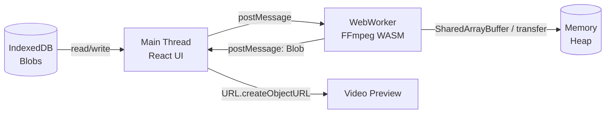

# ADR-20260703-03: FFmpeg WASM Client-Side — Video Processing sin Backend

**ID:** `ARCH-20260703-03`  
**Fecha:** 2026-07-03  
**Estado:** `[✓] Aceptado`  
**Autor:** INTEGRA  
**Dependencia:** `ARCH-20260703-01`

---

## 🎯 Contexto

**Problema:** El pipeline genera 6-7 clips de video (Veo) + audio (TTS) + subtítulos (VTT) que deben ensamblarse en un master final multi-formato (9:16, 1:1, 4:5, 16:9) con:
- Concatenación precisa con timestamps absolutos
- Burn-in de subtítulos con estilos de marca (fuente, color, outline, safe zones)
- Mezcla de audio (VO + music bed opcional) con ducking
- Encoding H.264/H.265, bitrates adaptados por plataforma

**Restricción:** **Cero backend de video** — No FFmpeg en servidor, no transcoding cloud, no costos de GPU/encoding, no latencia de subida/bajada de archivos grandes.

---

## 🏛️ Decisión: FFmpeg WASM en WebWorker (Client-Side Only)

### Por qué FFmpeg WASM

| Alternativa | Descarte |
|-------------|----------|
| **Backend FFmpeg (AWS Lambda, Cloud Run, Modal)** | Costo, cold starts, subida/bajada GBs, mantenimiento infra |
| **MediaRecorder API + Canvas** | No concat preciso, no burn subs, no audio mixing, solo encoding nativo navegador |
| **WebCodecs API** | Bajo nivel, manual, sin filtros complejos (subtitles, overlay, color grading) |
| **Remotion** | React-based, bueno para generación programática, no para concat de blobs arbitrarios |
| **FFmpeg WASM (@ffmpeg/ffmpeg)** | ✅ Completo, maduro, WebWorker, 25MB core, cacheable, offline-capable |

### Arquitectura: Off Main Thread



**Componentes:**
1. **`/public/ffmpeg-core/`** — `ffmpeg-core.js` + `ffmpeg-core.wasm` (servidos estáticos, cache headers)
2. **`workers/ffmpeg.worker.ts`** — WebWorker dedicado, ciclo de vida gestionado
3. **`services/ffmpeg.ts`** — API Promise-based para UI, maneja transferencia de blobs

---

## 📦 ESPECIFICACIÓN TÉCNICA

### 1. Inicialización (Lazy, Cached)

```typescript
// workers/ffmpeg.worker.ts
import { createFFmpeg, fetchFile } from '@ffmpeg/ffmpeg';

const ffmpeg = createFFmpeg({
  corePath: '/ffmpeg-core/ffmpeg-core.js',  // Servido por Vite desde public/
  log: (msg) => self.postMessage({ type: 'LOG', payload: msg }),
  progress: (p) => self.postMessage({ type: 'PROGRESS', payload: p }),
});

let isLoaded = false;

self.onmessage = async (e: MessageEvent<WorkerMessage>) => {
  const { type, payload, requestId } = e.data;

  try {
    switch (type) {
      case 'INIT':
        if (!isLoaded) {
          await ffmpeg.load();
          isLoaded = true;
        }
        self.postMessage({ type: 'READY', requestId });
        break;

      case 'CONCAT':
        await execConcat(payload, requestId);
        break;

      case 'BURN_SUBS':
        await execBurnSubs(payload, requestId);
        break;

      case 'MIX_AUDIO':
        await execMixAudio(payload, requestId);
        break;

      case 'SMART_CONCAT':
        await execSmartConcat(payload, requestId);
        break;

      case 'EXPORT_MULTI_RATIO':
        await execExportMultiRatio(payload, requestId);
        break;

      case 'TERMINATE':
        ffmpeg.exit();
        self.close();
        break;
    }
  } catch (error) {
    self.postMessage({ type: 'ERROR', requestId, payload: error.message });
  }
};
```

### 2. Operaciones Core

#### CONCAT (Concat Demuxer - Frame Accurate)

```typescript
async function execConcat(payload: ConcatPayload, requestId: string) {
  const { clips, outputName = 'concat.mp4' } = payload;
  
  // Escribir archivos en MEMFS
  for (let i = 0; i < clips.length; i++) {
    const name = `clip_${i}.mp4`;
    await ffmpeg.writeFile(name, await fetchFile(clips[i].blob));
    // File list para concat demuxer
    await ffmpeg.writeFile('filelist.txt', clips.map((_, i) => `file 'clip_${i}.mp4'`).join('\n'));
  }
  
  // Concat demuxer (rápido, sin re-encode si codecs iguales)
  await ffmpeg.run(
    '-f', 'concat', '-safe', '0',
    '-i', 'filelist.txt',
    '-c', 'copy',  // Stream copy = instantáneo
    '-movflags', '+faststart',
    outputName
  );
  
  const data = ffmpeg.FS('readFile', outputName);
  self.postMessage({ 
    type: 'RESULT', 
    requestId, 
    payload: new Blob([data.buffer], { type: 'video/mp4' }) 
  }, [data.buffer]); // Transfer ownership
}
```

#### BURN SUBTITLES (Filter Complex con Estilos Marca)

```typescript
async function execBurnSubs(payload: BurnSubsPayload, requestId: string) {
  const { videoBlob, vttContent, style, outputName = 'subbed.mp4' } = payload;
  
  await ffmpeg.writeFile('input.mp4', await fetchFile(videoBlob));
  await ffmpeg.writeFile('subs.vtt', new TextEncoder().encode(vttContent));
  
  // Force style ASS para control total
  const forceStyle = [
    `FontName=${style.fontFamily}`,
    `FontSize=${style.fontSize}`,
    `PrimaryColour=${hexToASS(style.color)}`,
    `Outline=${style.outline}`,
    `Shadow=${style.shadow}`,
    `MarginV=${style.marginV}`, // Safe zone bottom
    `Alignment=2`, // Bottom center
    `Bold=${style.bold ? 1 : 0}`,
  ].join(',');
  
  await ffmpeg.run(
    '-i', 'input.mp4',
    '-vf', `subtitles=subs.vtt:force_style='${forceStyle}'`,
    '-c:v', 'libx264', '-preset', 'fast', '-crf', '20',
    '-c:a', 'copy',
    '-movflags', '+faststart',
    outputName
  );
  
  const data = ffmpeg.FS('readFile', outputName);
  self.postMessage({ type: 'RESULT', requestId, payload: new Blob([data.buffer], { type: 'video/mp4' }) }, [data.buffer]);
}
```

#### MIX AUDIO (VO + Music Bed + Ducking)

```typescript
async function execMixAudio(payload: MixAudioPayload, requestId: string) {
  const { videoBlob, voBlob, musicBlob, ducking, outputName = 'mixed.mp4' } = payload;
  
  await ffmpeg.writeFile('input.mp4', await fetchFile(videoBlob));
  await ffmpeg.writeFile('vo.wav', await fetchFile(voBlob));
  if (musicBlob) await ffmpeg.writeFile('music.wav', await fetchFile(musicBlob));
  
  let filterComplex = '';
  if (musicBlob && ducking) {
    // Sidechain ducking: music baja cuando hay VO
    filterComplex = `
      [1:a]volume=1.0[vo];
      [2:a]volume=0.3,acompressor=threshold=-20dB:ratio=4:attack=10:release=100[music_ducked];
      [vo][music_ducked]amix=inputs=2:duration=first:dropout_transition=0[aout]
    `;
  } else if (musicBlob) {
    filterComplex = '[1:a][2:a]amix=inputs=2:duration=first:dropout_transition=0[aout]';
  } else {
    filterComplex = '[1:a]anull[aout]'; // Solo VO
  }
  
  await ffmpeg.run(
    '-i', 'input.mp4',
    '-i', 'vo.wav',
    ...(musicBlob ? ['-i', 'music.wav'] : []),
    '-filter_complex', filterComplex.trim(),
    '-map', '0:v',
    '-map', '[aout]',
    '-c:v', 'copy',
    '-c:a', 'aac', '-b:a', '128k',
    '-movflags', '+faststart',
    '-shortest', // Corta al más corto (video)
    outputName
  );
  
  const data = ffmpeg.FS('readFile', outputName);
  self.postMessage({ type: 'RESULT', requestId, payload: new Blob([data.buffer], { type: 'video/mp4' }) }, [data.buffer]);
}
```

#### SMART CONCAT (Solo re-encode segmentos cambiados)

```typescript
async function execSmartConcat(payload: SmartConcatPayload, requestId: string) {
  const { preservedClips, newClips, timelineOrder, outputName = 'master.mp4' } = payload;
  // preservedClips: { role, blob, startTime, duration }[]
  // newClips: { role, blob }[]
  // timelineOrder: ['bumper', 'atencion', 'interes', 'deseo', 'accion', 'cta']
  
  // 1. Escribir todos los clips necesarios
  const allClips = [...preservedClips, ...newClips];
  for (let i = 0; i < allClips.length; i++) {
    await ffmpeg.writeFile(`clip_${i}.mp4`, await fetchFile(allClips[i].blob));
  }
  
  // 2. Build filelist en orden de timeline
  const filelist = timelineOrder.map((role, idx) => {
    const clip = allClips.find(c => c.role === role);
    return `file 'clip_${allClips.indexOf(clip!)}.mp4'`;
  }).join('\n');
  await ffmpeg.writeFile('filelist.txt', filelist);
  
  // 3. Concat + Re-encode completo (garantiza timestamps, color grading unificado)
  await ffmpeg.run(
    '-f', 'concat', '-safe', '0', '-i', 'filelist.txt',
    // Color grading unificado (LUT + curvas)
    '-vf', 'lut3d=brand_lut.cube,colorbalance=rs=0.05:gs=-0.02:bs=0.03,curves=preset=cinematic,eq=contrast=1.1:brightness=0.02:saturation=1.15',
    '-c:v', 'libx264', '-preset', 'fast', '-crf', '20', '-profile:v', 'high', '-level', '4.1',
    '-c:a', 'aac', '-b:a', '128k',
    '-movflags', '+faststart',
    '-t', '30', // Hard cap 30s
    outputName
  );
  
  const data = ffmpeg.FS('readFile', outputName);
  self.postMessage({ type: 'RESULT', requestId, payload: new Blob([data.buffer], { type: 'video/mp4' }) }, [data.buffer]);
}
```

#### EXPORT MULTI-RATIO (Batch 4 encodes paralelos)

```typescript
async function execExportMultiRatio(payload: ExportMultiRatioPayload, requestId: string) {
  const { masterBlob, presets, outputPrefix = 'export' } = payload;
  // presets: [{ name, width, height, cropMode, safeZone }, ...]
  
  await ffmpeg.writeFile('master.mp4', await fetchFile(masterBlob));
  // LUT si existe
  if (payload.lutBlob) await ffmpeg.writeFile('brand_lut.cube', await fetchFile(payload.lutBlob));
  
  const results: ExportResult[] = [];
  
  for (const preset of presets) {
    const outputName = `${outputPrefix}_${preset.name}.mp4`;
    let vf = `scale=${preset.width}:${preset.height}:force_original_aspect_ratio=${preset.cropMode === 'cover' ? 'increase' : 'decrease'}`;
    
    if (preset.cropMode === 'cover') {
      vf += `,crop=${preset.width}:${preset.height}`;
    } else {
      vf += `,pad=${preset.width}:${preset.height}:(ow-iw)/2:(oh-ih)/2:color=black@0`;
    }
    
    // Safe zone overlay (opcional)
    if (preset.safeZone) {
      vf += `,drawbox=x=0:y=0:w=iw:h=${preset.safeZone.top}:color=red@0.3:t=fill,drawbox=x=0:y=ih-${preset.safeZone.bottom}:w=iw:h=${preset.safeZone.bottom}:color=red@0.3:t=fill`;
    }
    
    await ffmpeg.run(
      '-i', 'master.mp4',
      '-vf', vf,
      '-c:v', 'libx264', '-preset', 'fast', '-crf', '22',
      '-c:a', 'copy',
      '-movflags', '+faststart',
      outputName
    );
    
    const data = ffmpeg.FS('readFile', outputName);
    results.push({
      preset: preset.name,
      blob: new Blob([data.buffer], { type: 'video/mp4' }),
      width: preset.width,
      height: preset.height,
    });
  }
  
  self.postMessage({ type: 'RESULT', requestId, payload: results });
}
```

---

## 🔧 API DESDE UI (services/ffmpeg.ts)

```typescript
// services/ffmpeg.ts
class FFmpegService {
  private worker: Worker;
  private pending = new Map<string, { resolve: Function; reject: Function }>();
  private initPromise: Promise<void>;

  constructor() {
    this.worker = new Worker(new URL('../workers/ffmpeg.worker.ts', import.meta.url), { type: 'module' });
    this.worker.onmessage = this.handleMessage.bind(this);
    this.initPromise = this.send('INIT', {});
  }

  private handleMessage(e: MessageEvent<WorkerResponse>) {
    const { type, requestId, payload } = e.data;
    const pending = this.pending.get(requestId);
    if (!pending) return;

    if (type === 'RESULT' || type === 'READY') {
      pending.resolve(payload);
    } else if (type === 'ERROR') {
      pending.reject(new Error(payload));
    } else if (type === 'PROGRESS') {
      // Emitir evento progreso para UI
      this.onProgress?.(payload);
    }
    this.pending.delete(requestId);
  }

  private send<T>(type: string, payload: any): Promise<T> {
    return new Promise((resolve, reject) => {
      const requestId = crypto.randomUUID();
      this.pending.set(requestId, { resolve, reject });
      this.worker.postMessage({ type, payload, requestId });
    });
  }

  async init() { await this.initPromise; }

  async concatClips(clips: Blob[]): Promise<Blob> {
    return this.send('CONCAT', { clips: clips.map(blob => ({ blob })) });
  }

  async burnSubtitles(video: Blob, vtt: string, style: SubtitleStyle): Promise<Blob> {
    return this.send('BURN_SUBS', { videoBlob: video, vttContent: vtt, style });
  }

  async mixAudio(video: Blob, vo: Blob, music?: Blob, ducking = true): Promise<Blob> {
    return this.send('MIX_AUDIO', { videoBlob: video, voBlob: vo, musicBlob: music, ducking });
  }

  async smartConcat(params: SmartConcatParams): Promise<Blob> {
    return this.send('SMART_CONCAT', params);
  }

  async exportMultiRatio(master: Blob, presets: ExportPreset[], lut?: Blob): Promise<ExportPack> {
    return this.send('EXPORT_MULTI_RATIO', { masterBlob: master, presets, lutBlob: lut });
  }

  terminate() { this.worker.postMessage({ type: 'TERMINATE' }); }
}

export const ffmpegService = new FFmpegService();
```

---

## 📊 RENDIMIENTO Y LIMITES

| Métrica | Valor Típico | Nota |
|---------|--------------|------|
| **Core WASM Size** | ~25 MB (gz: ~8 MB) | Cacheado por Service Worker / HTTP Cache |
| **Init Time (cached)** | 800-1500 ms | `ffmpeg.load()` una vez por sesión |
| **Concat 6 clips (copy)** | < 2 s | Stream copy, sin re-encode |
| **Burn Subs (re-encode)** | 10-20 s | libx264 fast preset |
| **Mix Audio** | 5-10 s | AAC encoding |
| **Smart Concat (full re-encode)** | 20-40 s | 6 clips 1080p → 1080p |
| **Export 4 Ratios** | 60-120 s | Paralelo en worker (secuencial por FFmpeg instance) |
| **Memory Peak** | 300-500 MB | Heap WASM + buffers |
| **Blob Transfer** | Zero-copy | `postMessage` con transfer ownership |

---

## 🛡️ MANEJO DE ERRORES Y RECUPERACIÓN

| Error | Estrategia |
|-------|------------|
| **OOM (Out of Memory)** | Catch → `worker.terminate()` → `new Worker()` → retry con `-crf 25` (menor calidad) |
| **WASM Compile Error** | Fallback: `MediaRecorder` + Canvas (solo concat simple, sin subs) |
| **Codec Not Supported** | Force `-c:v libx264` siempre, no copy si mismatch |
| **Progress Stall** | Timeout 5 min → kill worker → report error |
| **Corrupt Output** | Verify `ffprobe` (WASM) duration > 0 → retry |

---

## ✅ CRITERIOS DE ACEPTACIÓN

- [ ] `ffmpegService.init()` < 2s en warm start
- [ ] Concat 6 clips (stream copy) < 3s → output reproducible
- [ ] Burn subtítulos con estilos marca (fuente, color, outline, safe zone) → visual check
- [ ] Mix VO + Music con ducking → audio audible, VO prioritario
- [ ] Smart Concat: preserva 4 clips, regenera 2 → master en < 45s
- [ ] Export 4 ratios (9:16, 1:1, 4:5, 16:9) → 4 MP4s válidos + safe zones
- [ ] Memory < 600MB peak en Chrome DevTools
- [ ] Worker no bloquea UI (interacción fluida durante encoding)
- [ ] Cleanup: `terminate()` libera memoria, nueva instancia funciona

---

**Firma:** INTEGRA  
**Implementación:** SOFIA (Sprint 1, Tarea 1.14 + Sprint 3, Tarea 3.3)  
**Auditoría:** GEMINI (Post-S1, Post-S3)