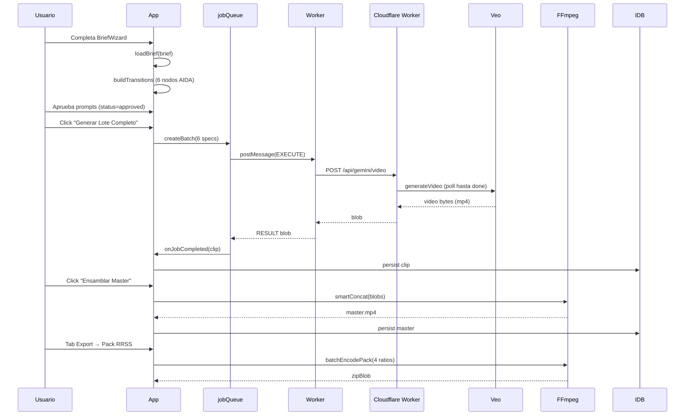
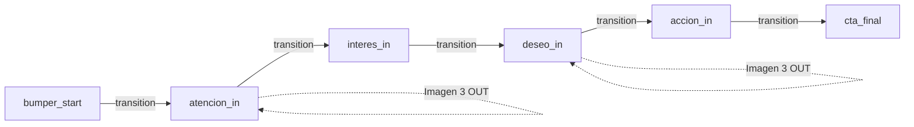
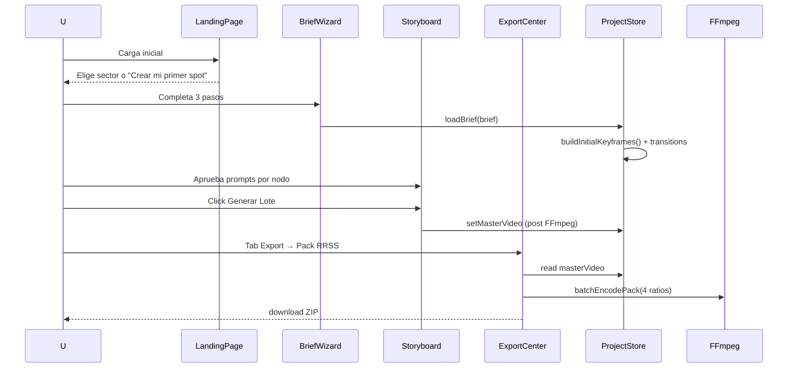

# Arquitectura

```mermaid
flowchart TB
  subgraph Browser["Browser (Vite SPA)"]
    UI[React UI + Zustand]
    IDB[(IndexedDB)]
    FF[FFmpeg WASM Worker]
    JQ[Job Queue (in-memory)]
  end

  subgraph Cloudflare["Cloudflare Worker"]
    Proxy["/api/gemini/* proxy"]
  end

  subgraph GoogleAI["Google AI APIs"]
    Veo[Veo 3.1]
    Imagen[Imagen 3]
    TTS[Gemini TTS]
  end

  UI -->|loadBrief| IDB
  UI -->|video_generation| JQ
  JQ -->|Worker postMessage| FF
  JQ -->|fetch /api/gemini/*| Proxy
  Proxy -->|HTTPS + API key| Veo
  Proxy -->|HTTPS + API key| Imagen
  Proxy -->|HTTPS + API key| TTS
  FF -->|video/mp4 blob| UI
```

## Pipeline de generación



## Keyframe Chain (anti-alucinación)



Cada transición usa **Image-to-Video** con keyframes consecutivos, evitando drift semántico. Si una transición falla (quota/safety/timeout), se aplica fallback a imagen estática con zoom (5s por nodo perdido).

## Decisiones Arquitectónicas (ADRs)

| ADR | Título | Estado |
|---|---|---|
| ADR-01 | Standalone SPA, Gemini-only, Keyframe Chain AIDA | Aceptado |
| ADR-02 | Cloudflare Worker como proxy de API keys | Aceptado |
| ADR-03 | FFmpeg WASM client-side (no servidor) | Aceptado |
| ADR-04 | Keyframe Chain con prompts por etapa (no prompt monolítico) | Aceptado |
| ADR-05 | JobQueue reactivo en lugar de generación bloqueante | Aceptado |
| ADR-06 | FFmpeg copia a `dist/ffmpeg-core/` vía postinstall (no CDN) | Aceptado |
| ADR-07 | IndexedDB para clips/master, localStorage para UI efímero | Aceptado |

## Stores (Zustand)

### `useProjectStore` — persistido en IndexedDB

Estado central del proyecto:

```ts
interface ProjectState {
  brief: MasterBrief | null;
  brandKit: BrandKit | null;
  globalStylePrompt: string;
  keyframes: Map<KeyframeId, Keyframe>;
  orderedKeyframes: KeyframeId[];
  transitions: Map<TransitionId, KeyframeTransition>;
  clips: Map<TransitionId, Blob>;
  voiceover: { audioBlob: Blob; vtt: string } | null;
  subtitles: { vtt: string; style: SubtitleStyle } | null;
  masterVideo: Blob | null;
  masterVideoUrl: string | null;
  exportPack: ExportPackOutput | null;
  manifest: ProjectManifest | null;
}
```

Acciones clave: `loadBrief`, `buildTransition`, `approveTransitionPrompt`, `setMasterVideo`, `resetProject`.

### `useUIStore` — localStorage (parcial)

Estado efímero:

```ts
interface UIState {
  currentStep: 'brief' | 'storyboard' | 'export';
  briefStep: 0 | 1 | 2 | 3;
  toasts: Toast[];
  exportCenterOpen: boolean;
  splitViewTransitionId: string | null;
  hasSeenTour: boolean;
  showTourOnNextRender: boolean;
}
```

`hasSeenTour` se persiste en `localStorage['bridge.hasSeenTour.v1']`. El resto es transitorio.

### `useApiKeysStore` — sesión

Estado de conexión al proxy:

```ts
interface ApiKeysState {
  proxyConnected: boolean;
  lastCheckedAt: number | null;
  latencyMs: number | null;
  safetyFlagsEnabled: boolean;
}
```

## Workers

### `src/workers/job.worker.ts`

Maneja `video_generation` y `image_generation` con retry exponencial (1s, 2s, 4s, 8s, 16s) y clasificación de errores:

- `quota rate` → retryable
- `safety blocked` → no retry, fallback inmediato
- `timeout` → retryable

Cada resultado se comunica con `{ type: 'RESULT', jobId, blob, fallbackUsed, fallbackReason, attempts, totalLatencyMs }`.

### `src/workers/ffmpeg.worker.ts`

Handlers soportados:

- `INIT` — cargar core wasm
- `CONCAT` — concatenar clips en orden
- `BURN_SUBS` — quemar VTT en video
- `MIX_AUDIO` — mezclar voiceover + música
- `SMART_CONCAT` — concat con subs + audio opcionales
- `EXPORT_RATIO` — encode a un aspect ratio (9:16, 1:1, 4:5, 16:9)
- `STATIC_FROM_IMAGE` — imagen → video estático (fallback)
- `TERMINATE` — cleanup

## Servicios

| Servicio | Responsabilidad |
|---|---|
| `gemini/client.ts` | Fetch wrapper con backoff y retry |
| `gemini/video.ts` | Veo I2V + polling + classify errors |
| `gemini/imageAnalysis.ts` | Vision → VisualAnalysis |
| `gemini/keyframeGenerator.ts` | Imagen 3 para KF_OUT |
| `gemini/tts.ts` | Gemini TTS → PCM → WAV |
| `costEstimator.ts` | Pricing hardcoded por modelo |
| `jobQueue.ts` | BackgroundJobQueue con IDB + parallelSlots=3 |
| `fallbackStrategy.ts` | Strategy 1: static image → Strategy 2: plain color |
| `smartConcat.ts` | FFmpeg smart concat con subs + audio opcionales |
| `shareLink.ts` | blob URL + QR + embed |
| `exportBatch.ts` | Multi-ratio encode paralelo |
| `telemetry.ts` | Opt-in GDPR-safe (con PII limitado) |
| `analytics.ts` | S6 — Eventos anónimos opt-in (sin PII) |
| `versionHistory.ts` | IDB store `bridge-versions` (max 5/transición) |
| `notification.ts` | Notification API + deep-link |
| `safeZoneBurn.ts` | Safe zones visuales en export |
| `exportPresets.ts` | Catálogo de aspect ratios + sizes |
| `zipHelper.ts` | JSZip wrapper con manifests |

## Hooks

- `useJobs()` — suscripción reactiva al jobQueue
- `useJobProgress()` — `allJobsCompleted` / `hasPending` (notifica al completar batch)
- `useViewport()` — breakpoint mobile/tablet/desktop
- `useFocusTrap(active, containerRef)` — focus trap para modales
- `useModalKeyboardShortcuts({enabled, onClose})` — Esc handler
- `useKeyboardShortcuts(config, enabled)` — atajos globales (g=Gallery, e=Export, etc.)

## Flujo de datos en una sesión típica



## Decisiones NO tomadas (deferrred)

- **Multi-tenant**: cada usuario tiene su propio brief; no hay sync entre cuentas.
- **Versionado de prompts en la nube**: solo local (IndexedDB `bridge-versions`).
- **Real-time collab**: fuera de scope (uso individual).
- **Marketplace de sector templates**: fuera de scope (templates hardcoded).