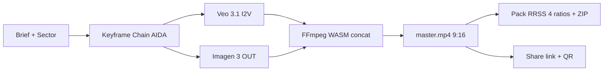
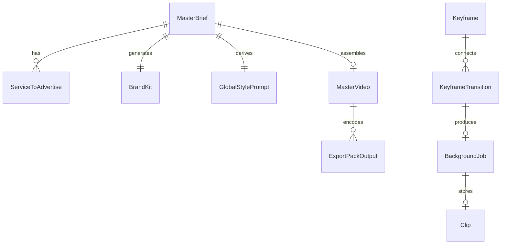

# Bridge Creative Engine

Genera spots AIDA en minutos para Reels, TikTok, Shorts. 100% local, sin tracking de personas.



## Quickstart

```bash
pnpm install
pnpm dev          # http://localhost:5173
```

## Stack

- **Frontend**: Vite 5 + React 18 + TypeScript 5
- **State**: Zustand + IndexedDB (offline-first via `idb`)
- **Video**: FFmpeg WASM (@ffmpeg/ffmpeg 0.12.x)
- **API proxy**: Cloudflare Worker (Wrangler 3.x) — API keys fuera del bundle
- **Modelos**: Gemini API (Veo 3.1, Imagen 3, TTS)
- **Tests**: Vitest 2 + Playwright 1.61
- **Storybook**: 8.x
- **CI/CD**: GitHub Actions (5 stages)

## Scripts

| Script | Descripción |
|---|---|
| `pnpm dev` | Servidor dev con HMR (puerto 5173) |
| `pnpm build` | Build production + FFmpeg core copy a `dist/` |
| `pnpm preview` | Preview del build local |
| `pnpm typecheck` | TypeScript sin emit (app + worker) |
| `pnpm lint` | ESLint con `--max-warnings 0` |
| `pnpm test` | Unit tests con Vitest |
| `pnpm test:coverage` | Unit tests + reporte coverage (umbral 80% lines / 70% branches) |
| `pnpm test:ui` | Vitest UI interactivo |
| `pnpm test:e2e` | E2E con Playwright + Chromium |
| `pnpm storybook` | Storybook dev (puerto 6006) |
| `pnpm storybook:build` | Build estático del catálogo |
| `pnpm worker:dev` | Cloudflare Worker local (puerto 8787) |
| `pnpm worker:deploy` | Deploy del Worker |
| `pnpm worker:typecheck` | Typecheck solo del Worker |
| `pnpm ci` | Pipeline completo: typecheck + lint + coverage + e2e + build |

## Deploy Producción

### Vercel (recomendado)

1. Conecta el repo a Vercel (import project).
2. Configuración detectada automáticamente (Vite):
   - Build command: `pnpm build`
   - Output directory: `dist`
   - Install command: `pnpm install --frozen-lockfile`
3. Variables de entorno: **ninguna requerida en el frontend** — el Worker inyecta la API key.
4. Deploy del Worker (independiente):
   ```bash
   pnpm worker:deploy  # requiere GEMINI_API_KEY en Cloudflare secrets
   ```
5. Configura el secreto `GEMINI_API_KEY`:
   ```bash
   wrangler secret put GEMINI_API_KEY
   ```

### Netlify

Equivalente a Vercel:
- Build command: `pnpm build`
- Publish directory: `dist`
- Functions: NO requiere (Worker es Cloudflare, no Netlify Functions)

### Otros (Cloudflare Pages, GitHub Pages, etc.)

`pnpm build` produce un bundle 100% estático (HTML + JS + assets + FFmpeg core). Cualquier hosting SPA funciona; no requiere SSR.

## Variables de entorno

| Variable | Dónde | Descripción |
|---|---|---|
| `GEMINI_API_KEY` | Cloudflare Worker | API key de Google AI Studio (secret, **nunca en repo**) |
| `VERCEL_TOKEN` | GitHub Secrets | Token de deploy automático (opcional, solo en CI) |
| `VERCEL_ORG_ID` | GitHub Secrets | Org ID de Vercel |
| `VERCEL_PROJECT_ID` | GitHub Secrets | Project ID de Vercel |

El frontend **no** requiere variables. El Worker se inyecta en runtime vía `/api/gemini/*` (path relativo).

## Modelo de datos (resumen)



Ver [`ARCHITECTURE.md`](./ARCHITECTURE.md) para el detalle completo.

## Tests

- **Unit**: `pnpm test` (Vitest, ~241 tests)
- **Coverage**: `pnpm test:coverage` — umbral 80% lines, 70% branches en `stores/`, `services/`, `hooks/`, `utils/`, `data/`.
- **E2E**: `pnpm test:e2e` (Playwright + Chromium, ~11 specs)
- **Storybook**: `pnpm storybook` (catálogo interactivo, 10+ componentes)

## Licencia

Privado / proyecto interno. Ver `LICENSE` si aplica.